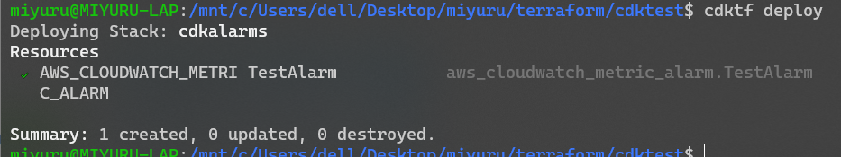
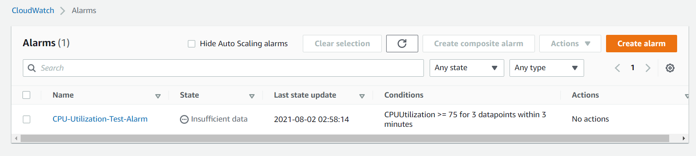

In this post I am going to show how to use Terraform CDK to create and manage cloudwatch alarms.

There are multiple benefits of using cdktf instead of plain terraform files.

* When there are lot alarms, the tf file can get large.
* Using tf loops to create multiple alarms is not easy to manage.
* Adding a new component to alarms gets harder. (Eg: New disk alarms)
* Can setup to automally add alarms to resources. (Eg: autoscaled instances)

First, if you don't know or havent install cdktf, use the tutorial from hashicorp to setup your environment and get familiar. https://learn.hashicorp.com/tutorials/terraform/cdktf-build-python?in=terraform/cdktf

What cdktf does is, it creates the tf files programmatically and then run the tf files using terraform as usual. So its better to choose the programming language that is most familiar to you. I will be using python.

First let's create a alarm. Be sure to fill in the variables.
```python
#!/usr/bin/env python
from constructs import Construct
from cdktf import App, TerraformStack
from imports.aws import AwsProvider, CloudwatchMetricAlarm

region = "eu-west-1"
profile = "test"  #change this

insid = "i-000123456789"
dimensions=dict(InstanceId=insid)
alarm_name = "CPU-Utilization-Test-Alarm"
metric_name = "CPUUtilization"
namespace = "AWS/EC2"
threshold = 75
alarm_description = "This metric monitors EC2 CPU utilization"
evaluation_periods = 3
period = 60
statistic = "Average"
comparison_operator = "GreaterThanOrEqualToThreshold"
alarm_actions = []

class MyStack(TerraformStack):
    def __init__(self, scope: Construct, ns: str):
        super().__init__(scope, ns)

        AwsProvider(self, 'Aws', region=region, profile=profile)

        CloudwatchMetricAlarm(self, "Test Alarm", alarm_name=alarm_name, comparison_operator=comparison_operator, evaluation_periods=evaluation_periods, dimensions=dimensions, metric_name=metric_name, namespace=namespace, period=period, statistic=statistic, threshold=threshold, alarm_description=alarm_description, alarm_actions=alarm_actions)

app = App()
MyStack(app, "cdkalarms")

app.synth()
```

You  may have noticed that I have created variables in the function itself and passing them via keyword arguments with the same keyword. This will come in handy when changing data or when creating multiple alarms in loops.

To deploy the it, run
```bash
cdktf deploy
```

The alarm should be now created.

You can view it the console as well.


To delete the test alarm, run

```bash
cdktf destroy
```

In the next post, let's look at how to create multiple alarms easily and dynamically.

> 💉 Find the part 2 of the article here. https://blog.miyuru.lk/cw-alarms-using-tfcdk-2/