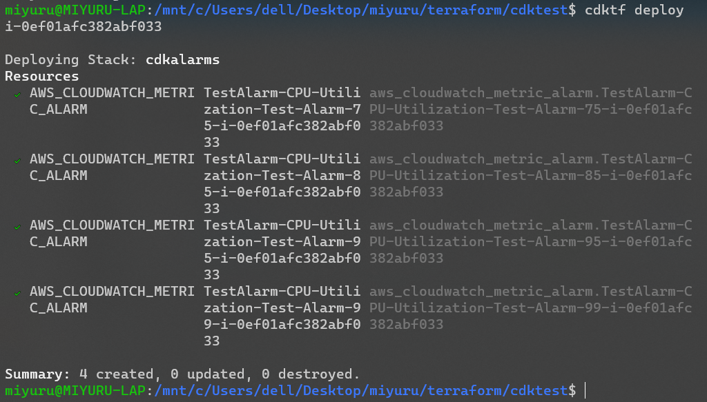
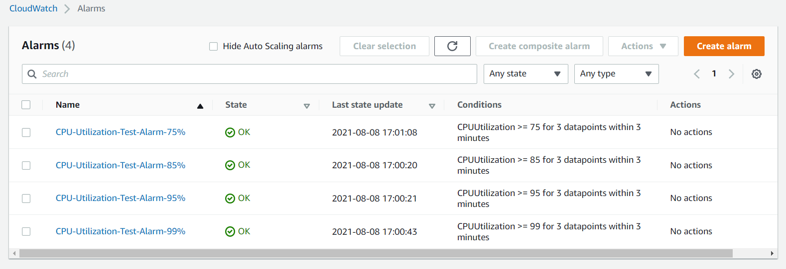

> 💉 Find the part 1 of the article here. https://blog.miyuru.lk/cw-alarms-using-tfcdk-1/

In this post, let's spice things up using loops and boto3.

Let's say you need to define multiple alarms with different thresholds.
```python
#!/usr/bin/env python
from constructs import Construct
from cdktf import TerraformStack
from imports.aws import AwsProvider, CloudwatchMetricAlarm

thresholds = [75,85,95,99]

evaluation_periods = 3
period = 60
statistic = "Average"
comparison_operator = "GreaterThanOrEqualToThreshold"
metric_name = "CPUUtilization"
namespace = "AWS/EC2"

for threshold_values in thresholds:
    insid = "i-000123456789"
    dimensions=dict(InstanceId=insid)
    threshold = threshold_values
    alarm_name = "CPU-Utilization-Test-Alarm-"+str(threshold_values)+"%"
    alarm_description = "This metric monitors EC2 "+str(threshold_values)+" CPU utilization"

    CloudwatchMetricAlarm(self, "Alarm"+alarm_name, ...)
```
This code will create 4 alarms that will trigger at 4 trigger points. If you need to add more trigger points its easy as adding value to the array.

Now if you want to create an alarm for instances for autoscale group or using tags, we can use boto3 to get the data.
```python
#!/usr/bin/env python
from constructs import Construct
from cdktf import TerraformStack
from imports.aws import AwsProvider, CloudwatchMetricAlarm
import boto3

region = "eu-west-1"
profile = "test"  #change this

ec2 = boto3.client('ec2', region_name=region, endpoint_url="https://api.ec2."+region+".aws")

boto3.setup_default_session(profile_name=profile)

thresholds = [75,85,95,99]

evaluation_periods = 3
period = 60
statistic = "Average"
comparison_operator = "GreaterThanOrEqualToThreshold"
metric_name = "CPUUtilization"
namespace = "AWS/EC2"
asg_group_name = "test-asg"

response = ec2.describe_instances(Filters=[{'Name': 'instance-state-name', 'Values': ['running']},{'Name': 'tag:aws:autoscaling:groupName', 'Values': [asg_group_name]}])

for res in response['Reservations']:
    for ins in res['Instances']:
        insid=ins["InstanceId"]
        print (insid)

        for threshold_values in thresholds:
            dimensions = dict(InstanceId=insid)
            threshold = threshold_values
            alarm_name = "CPU-Utilization-Test-Alarm-"+str(threshold_values)+"%"

            alarm_description = "This metric monitors EC2 CPU utilization"

            CloudwatchMetricAlarm(self, "Alarm"+alarm_name, ...)
```
This code will call the autoscaling API and get the instance IDs and create alarms for each instance with different thresholds.

Here is the completed code.
```python
#!/usr/bin/env python
from constructs import Construct
from cdktf import App, TerraformStack
from imports.aws import AwsProvider, CloudwatchMetricAlarm
import boto3

region = "eu-west-1"
profile = "test"  #change this

boto3.setup_default_session(profile_name=profile)

ec2 = boto3.client('ec2', region_name=region, endpoint_url="https://api.ec2."+region+".aws")

thresholds = [75,85,95,99]

evaluation_periods = 3
period = 60
statistic = "Average"
comparison_operator = "GreaterThanOrEqualToThreshold"
metric_name = "CPUUtilization"
namespace = "AWS/EC2"
asg_group_name = "test-asg"  #change this
alarm_actions = []

class MyStack(TerraformStack):
  def __init__(self, scope: Construct, ns: str):
    super().__init__(scope, ns)

    AwsProvider(self, 'Aws', region=region, profile=profile)

    response = ec2.describe_instances(Filters=[{'Name': 'instance-state-name', 'Values': ['running']},{'Name': 'tag:aws:autoscaling:groupName', 'Values': [asg_group_name]}])

    for res in response['Reservations']:
      for ins in res['Instances']:
        insid=ins["InstanceId"]
        print (insid)

        for threshold_values in thresholds:
          dimensions=dict(InstanceId=insid)
          threshold = threshold_values
          alarm_name = "CPU-Utilization-Test-Alarm-"+str(threshold_values)+"%"

          alarm_description = "This metric monitors EC2 CPU utilization"

          CloudwatchMetricAlarm(self, "Test Alarm-"+alarm_name+"-"+insid, alarm_name=alarm_name, comparison_operator=comparison_operator, evaluation_periods=evaluation_periods, dimensions=dimensions, metric_name=metric_name, namespace=namespace, period=period, statistic=statistic, threshold=threshold, alarm_description=alarm_description, alarm_actions=alarm_actions)


app = App()
MyStack(app, "cdkalarms")

app.synth()
```
> 👉 Remember to create an auto scaling group and change the variables accordingly.

To deploy the it, run
```bash
cdktf deploy
```

The alarms should be now created.

You can view it the console as well.


To delete the test alarms, run

```bash
cdktf destroy
```

The documentation and the stackoverflow answers for CDK is non existent at the moment, so if an error occurs, it might be hard to track now down.

 From this post, you can see how TerraformCDK can help you easily manage terraform code. 
 
