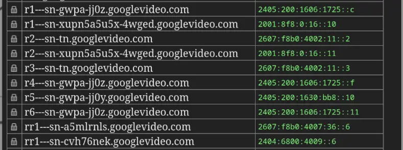

I use [IPvFoo](https://addons.mozilla.org/en-US/firefox/addon/ipvfoo/) to check website connectivity and I noticed that YouTube video domains had funny-looking subdomains.

So I did some digging for more these domains and found this [repo](https://github.com/skyoo/googlevideo_subdomains).

Looking at the repo and PTR records of the IPs, it looked like that these domains are encoded using a simple [Caesar cipher](https://en.wikipedia.org/wiki/Caesar_cipher). The domains are structured like `r[num]---sn-[encodedid].googlevideo.com`.

So with a little bit of Python, I got the cipher maps for the domains.

| Plain   | Cipher  |
|---------|---------|
| 0       | 7       |
| 1       | e       |
| 2       | l       |
| 3       | s       |
| 4       | z       |
| 5       | 6       |
| 6       | d       |
| 7       | k       |
| 8       | r       |
| 9       | y       |
| a       | 5       |
| b       | c       |
| c       | j       |
| d       | q       |
| e       | x       |
| f       | 4       |
| g       | b       |
| h       | i       |
| i       | p       |
| j       | w       |
| k       | 3       |
| l       | a       |
| m       | h       |
| n       | o       |
| o       | v       |
| p       | 2       |
| r       | g       |
| s       | n       |
| t       | u       |
| u       | 0       |
| v       | 8       |
| w       | f       |
| x       | m       |
| y       | t       |
| z       | 1       |

I created the liitle html page to decode this in the browser, you can view it https://miyuru.lk/ggcdomaindecorder

Looks like encoded bits are mostly ISP ID and the server ID in google systems. Why they thought to encode this info is still a mystery.
