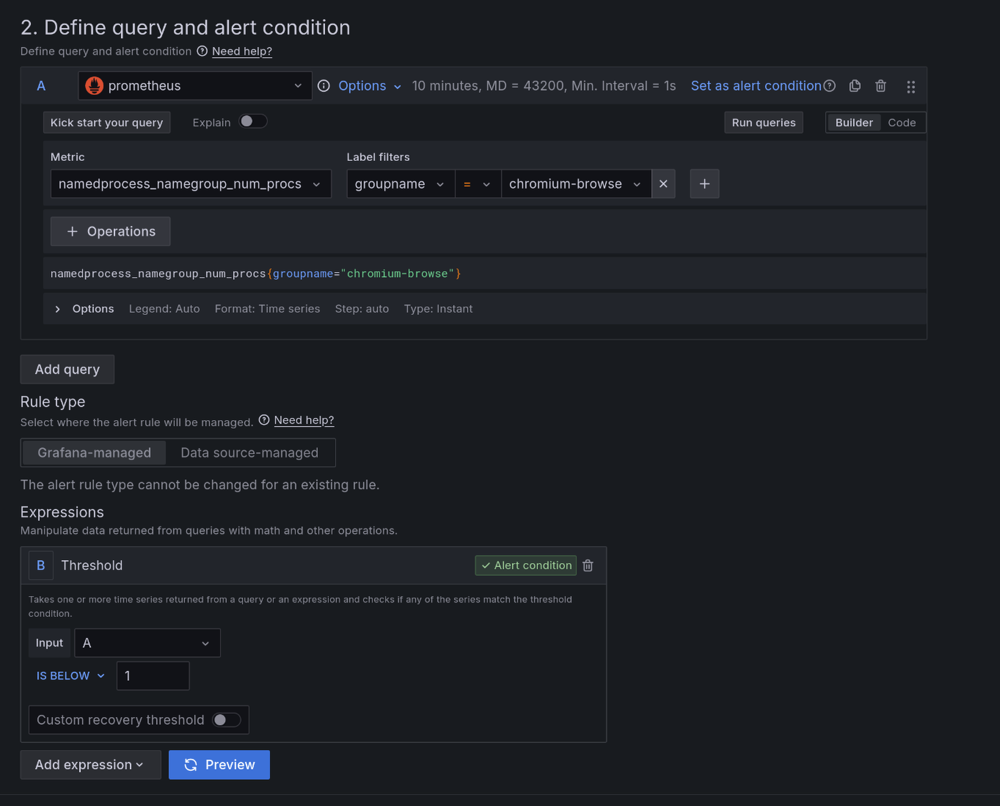
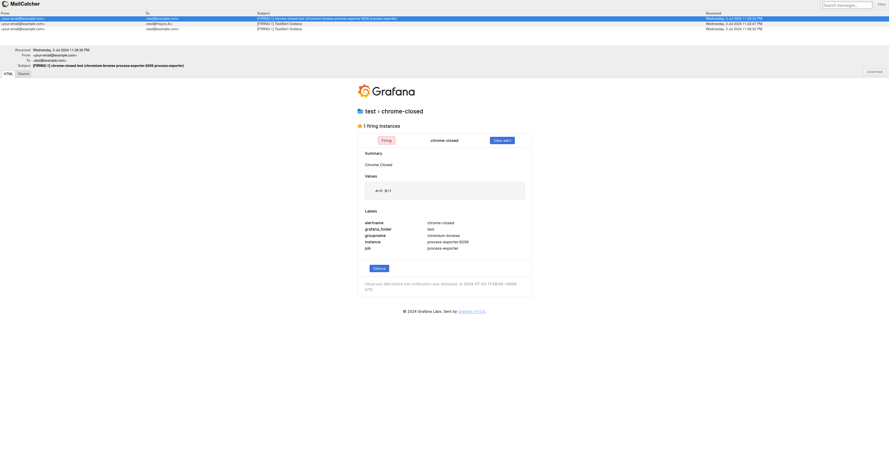

In the world of modern application development and infrastructure management, effective monitoring is crucial. Grafana provides a powerful platform for visualizing and alerting on various metrics. In this post, we will walk through setting up Grafana and configuring alerts. 

We will use a setup that includes Prometheus and Process Exporter to monitor our environment. Grafana will be used to visualize the metrics and set up alerts. We will also use MailCatcher to test email-based alerts.

### Prerequisites

Before we start, ensure you have Docker and Docker Compose installed on your system.

### Docker Compose Configuration

Below is the Docker Compose file that will set up Prometheus, Grafana, Process Exporter, and MailCatcher.

```yaml
version: '3.8'

networks:
  monitoring:
    driver: bridge

volumes:
  prometheus_data: {}
  grafana_storage: {}

services:
  grafana:
    image: grafana/grafana-oss
    container_name: grafana
    restart: unless-stopped
    ports:
     - '3000:3000'
    volumes:
     - 'grafana_storage:/var/lib/grafana'
    environment:
      - GF_SMTP_ENABLED=true
      - GF_SMTP_HOST=mailcatcher:1025
      - GF_SMTP_FROM_ADDRESS=your-email@example.com
    networks:
      - monitoring

  process-exporter:
    image: ncabatoff/process-exporter
    container_name: process-exporter
    privileged: true
    volumes:
      - /proc:/host/proc:ro
      - ./filename.yml:/config/filename.yml
    command:
      - '--procfs=/host/proc'
      - '-config.path=/config/filename.yml'
    expose:
      - 9256
    networks:
      - monitoring
    depends_on:
      - prometheus

  prometheus:
    image: prom/prometheus:latest
    container_name: prometheus
    restart: unless-stopped
    volumes:
      - ./prometheus.yml:/etc/prometheus/prometheus.yml
      - prometheus_data:/prometheus
    command:
      - '--config.file=/etc/prometheus/prometheus.yml'
      - '--storage.tsdb.path=/prometheus'
      - '--web.console.libraries=/etc/prometheus/console_libraries'
      - '--web.console.templates=/etc/prometheus/consoles'
      - '--web.enable-lifecycle'
    expose:
      - 9090
    networks:
      - monitoring
    depends_on:
      - grafana

  mailcatcher:
    image: schickling/mailcatcher
    container_name: mailcatcher
    restart: unless-stopped
    ports:
      - "1080:1080"
      - "1025:1025"
    networks:
      - monitoring
```

### Step-by-Step Setup

1. **Create Docker Compose File**

   Save the above Docker Compose configuration in a file named `docker-compose.yml`.

2. **Create Prometheus Configuration**

   Create a `prometheus.yml` file with the following content:

   ```yaml
   global:
     scrape_interval: 10s

   scrape_configs:
     - job_name: 'prometheus'
       static_configs:
         - targets: ['prometheus:9090']

     - job_name: 'process-exporter'
       static_configs:
         - targets: ['process-exporter:9256']
   ```

   This configuration file sets up Prometheus to scrape metrics from itself and the Process Exporter.

3. **Create Process Exporter Configuration**

   Create a `filename.yml` file for the process exporter:

   ```yaml
   process_names:
     - name: "{{.Comm}}"
       cmdline:
         - '.+'
   ```

4. **Start Services**

   In the directory containing your `docker-compose.yml`, run the following command:

   ```bash
   docker-compose up -d
   ```

   This command will start all the services in the background.

   >⚠️ If there are any issues use `docker logs $container_name` to check the logs.

### Access Grafana

Open your browser and go to `http://localhost:3000`. The default login credentials are:
- Username: `admin`
- Password: `admin`

### Adding Data Source

1. In Grafana, navigate to **Configuration** -> **Data Sources**.
2. Click **Add data source**.
3. Select **Prometheus**.
4. Set the URL to `http://prometheus:9090`.
5. Click **Save & Test**.

### Setting Up Email-Based Alerts

In Grafana:
1. Go to **Alerting** -> **Contact points**.
2. Click **Contact point**.
3. Name your contact point and select **Email** as the type.
4. Enter the recipient email address.
5. Save the contact point.

### Setting Up Alerts

We want to monitor the chrome browser procces in this test.

1. Navigate to the **Alert** tab.
2. Click **Create Alert**.
3. In new alert page add the following query.
`namedprocess_namegroup_num_procs{groupname="chromium-browse"}`
4. Set Threshold to monitor input A and alert if below 1.




5. select the email contact point configured previously.
6. Save the alert.

### Test Email Alerts

To test the email alerts, open your browser and go to `http://localhost:1080` to access MailCatcher's web interface.

Open and close the chrome browser and wait a few minutues.

You should see the email notification in the web UI and that the alert is triggerd on the grafana UI.



