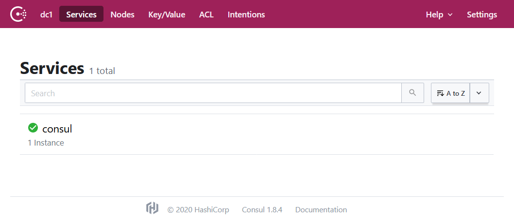
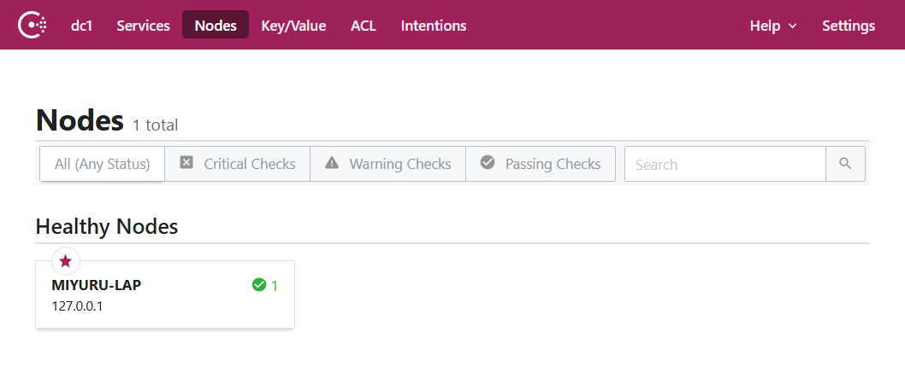

In this tutorial, we will be installing Consul on Debian 10 buster in a single node.

First cd to temp folder
```bash
cd /tmp
```

Install the necessary packages.
```bash
sudo apt install curl jq unzip
```

> Please note checkpoint-api.hashicorp.com is a IPv4 only endpoint at the time of the writing.

To install the latest version use the following commands. It will check the system architecture as well.
```bash
consul_version=`curl https://checkpoint-api.hashicorp.com/v1/check/consul | jq .current_version |  tr -d '"'`
system_arch=`uname -m | grep -q 'x86_64' && echo 'amd64' || echo "arm64"`
curl "https://releases.hashicorp.com/consul/${consul_version}/consul_${consul_version}_linux_${system_arch}.zip" > consul.zip
```

unzip the consul zip.
```bash
unzip consul.zip
```

Move the file to local bin, so it can accessed at any path and add the executable permission.
```bash
sudo cp consul /usr/local/bin/
sudo chmod +x /usr/local/bin/consul
```

check if the consul is working by checking the version.
```bash
consul --version
```

If the all is well you should see a output like below.
```output
Consul v1.8.4
Revision 12b16df32
Protocol 2 spoken by default, understands 2 to 3 (agent will automatically use protocol >2 when speaking to compatible agents)
```

Start the consul agent in dev mode.
```bash
consul agent -dev
```

by default the consul UI will run on 8500 port.

visit [http://localhost:8500/](http://localhost:8500/) to view the consul UI.

You should see output like below with consul services.



Click the nodes in header and you view consul nodes.



CRTL-C on the terminal to to stop the process.

You have now successfully setup single consul node.