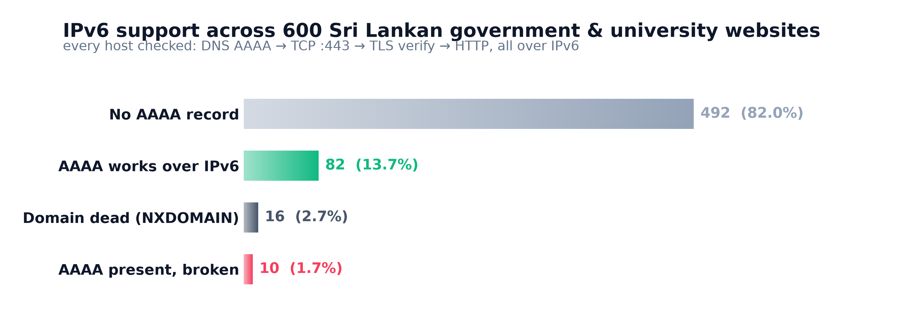
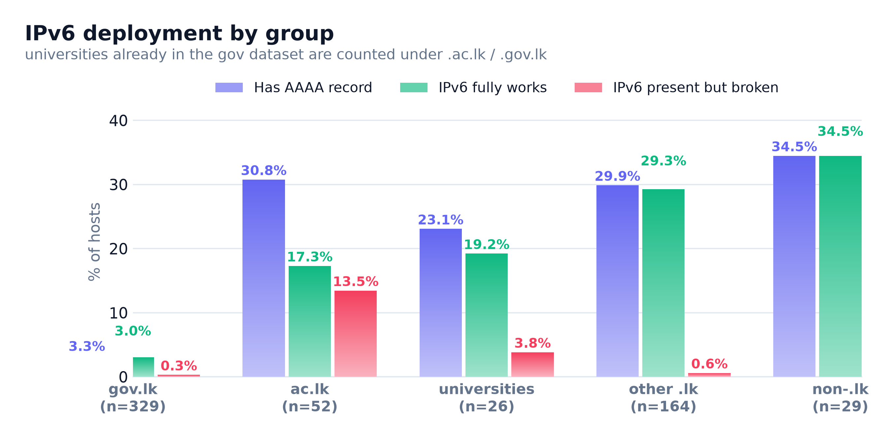
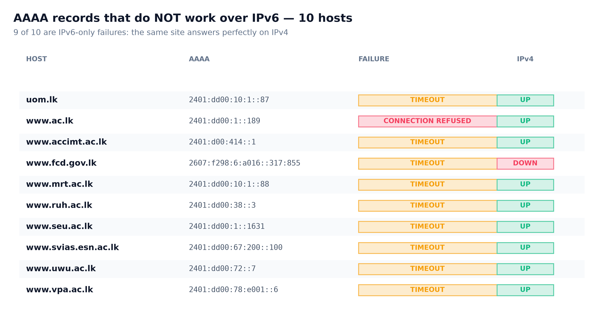
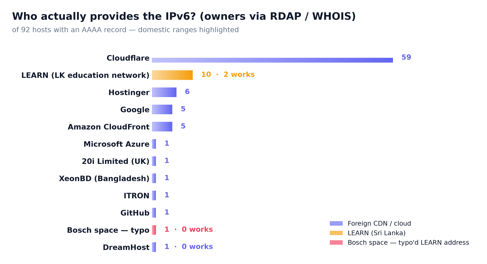

Most Sri Lankan government websites still have no IPv6 at all — and the ones that do are mostly riding on foreign CDNs. I measured **600 websites** end-to-end over IPv6: DNS lookup, TCP connect, certificate verification and an HTTP request, all forced down the IPv6 path.

This measurement was directly inspired by Anurag Bhatia's post on [Measuring IPv6 deployment on Indian Govt websites](https://anuragbhatia.com/post/2026/06/ipv6-on-indian-govt-websites/). Anurag found only 3.5% of `*.gov.in` / `*.nic.in` domains with working IPv6 and, more interestingly, 13 domains that had a AAAA record but no listener behind it. Sri Lanka deserved the same treatment — raw data included at the end.



## The dataset

There is no authoritative list of Sri Lankan government websites, but the closest thing is [nuuuwan's `gov_lk_web_auditor`](https://github.com/nuuuwan/gov_lk_web_auditor), which maintains a curated `static_data/websites.json`. I used [my fork of it](https://github.com/miyurusankalpa/gov_lk_web_auditor/blob/patch-1/static_data/websites.json), which adds one important missing entry: **`https://www.ac.lk/`** — LEARN, the Lanka Education and Research Network that literally runs the `.ac.lk` zone.

On top of that I added Sri Lanka's universities from Wikipedia's [List of universities in Sri Lanka](https://en.wikipedia.org/wiki/List_of_universities_in_Sri_Lanka): the 17 UGC state universities, 5 other government universities and 16 degree-awarding institutes, with official websites resolved through Wikidata (`P856`), falling back to Wikipedia external links and finally a DNS-verified guess. 18 of them were already in the fork's dataset and were deduplicated.

**Final dataset: 604 URLs across 600 unique hostnames.**

## Method

For each hostname, in order:

1. **DNS** — `dig +short A` and `dig +short AAAA` (follows CNAMEs). No AAAA → done, verdict `no_aaaa`.
2. **TCP** — connect to port 443 on each IPv6 address, 6s timeout.
3. **TLS** — handshake on *that same IPv6 socket*, with full certificate verification against the system CA store, SNI = hostname.
4. **HTTP** — `HEAD /` (GET fallback) over the verified connection, capture the status code.

Any host that failed over IPv6 got an IPv4 TCP probe as well, so I could tell the difference between *broken IPv6* and *site is simply dead*. The whole run needs a dual-stack machine — I ran it from a host with working native IPv6.

The script is a single Python file, standard library + `dig` only:

```bash
curl -sL https://blog.miyuru.lk/lk_ipv6_audit.py -o lk_ipv6_audit.py
python3 lk_ipv6_audit.py --input websites_merged.json --workers 24
```

## Results

| Verdict | Count | % |
|---|---:|---:|
| No AAAA record | 492 | 82.0% |
| AAAA, everything works over IPv6 | 82 | 13.7% |
| Domain dead (NXDOMAIN) | 16 | 2.7% |
| AAAA present but broken | 10 | 1.7% |

**92 hosts (15.3%) publish an AAAA record. Of those, 82 (89.1%) actually work end-to-end over IPv6.** That's the good news: when a Sri Lankan site has IPv6, it's usually real IPv6 — all 82 successful connections passed strict certificate verification, 80 of them on TLS 1.3, and 66 returned a plain `200`.

The bad news is the denominator: **82% of all hosts have no IPv6 address at all.**

## By group



| Group | Hosts | With AAAA | Works | % with AAAA |
|---|---:|---:|---:|---:|
| `.gov.lk` | 329 | 11 | 10 | **3.3%** |
| `.ac.lk` | 52 | 16 | 9 | 30.8% |
| New university entries | 26 | 6 | 5 | 23.1% |
| Other `.lk` | 164 | 49 | 48 | 29.9% |
| Non-`.lk` (com/org/…) | 29 | 10 | 10 | 34.5% |

The headline number: **only 3.3% of Sri Lankan government websites have an AAAA record** — comparable to Anurag's 3.5% for Indian central/state government sites. Grouping note: universities whose hosts already appear in the government dataset (e.g. `www.cmb.ac.lk`) are counted under `.ac.lk` here, the "new university entries" row is only the 26 hosts that had to be added.

## The broken ones

Ten hosts publish an AAAA record and then fail when you actually try to use it. **Nine of them are IPv6-only failures — IPv4 works perfectly fine on the same host.**



| Host | AAAA | Failure | IPv4 |
|---|---|---|---|
| `uom.lk` | `2401:dd00:10:1::87` | timed out | up |
| `www.ac.lk` | `2401:dd00:1::189` | **connection refused** | up |
| `www.accimt.ac.lk` | `2401:d00:414::1` | timed out | up |
| `www.fcd.gov.lk` | `2607:f298:6:a016::317:855` | timed out | down ¹ |
| `www.mrt.ac.lk` | `2401:dd00:10:1::88` | timed out | up |
| `www.ruh.ac.lk` | `2401:dd00:38::3` | timed out | up |
| `www.seu.ac.lk` | `2401:dd00:1::1631` | timed out | up |
| `www.svias.esn.ac.lk` | `2401:dd00:67:200::100` | timed out | up |
| `www.uwu.ac.lk` | `2401:dd00:72::7` | timed out | up |
| `www.vpa.ac.lk` | `2401:dd00:78:e001::6` | timed out | up |

¹ The table is the audit snapshot. `www.fcd.gov.lk` was re-checked afterwards and serves HTTP on port 80 — see point 3 below.

Three things stand out:

**1. `www.ac.lk` — the .ac.lk registry itself has broken IPv6.** LEARN publishes `2401:dd00:1::189` for its own site, but ports 80 and 443 actively refuse connections over IPv6 (`RST`), while IPv4 returns `200 OK`:

```console
$ curl -6 -sI https://www.ac.lk/          # refused
$ curl -4 -sI https://www.ac.lk/          # HTTP/1.1 200 OK
$ curl -6 https://2401:dd00:1::189/       # Connection refused (ports 80, 443)
```

The organisation that operates the `.ac.lk` DNS zone has a AAAA record pointing at a host with no web server listening on IPv6.

**2. Eight of the ten broken hosts sit on `2401:dd00::/32`** — Sri Lanka's domestic education/research network, operated by LEARN. It's not one or two flaky servers: `mrt`, `ruh`, `seu`, `uwu`, `vpa`, `svias`, `uom` and `ac.lk` all advertise IPv6 addresses that black-hole TCP. Across that whole prefix exactly **two** hosts have a working web server over IPv6: `www.pgis.lk` and `www.ucsc.cmb.ac.lk`. Whoever runs that network has enabled AAAA at the DNS level but not actually made the web tier reachable over IPv6.

`www.accimt.ac.lk` is the odd one out: its AAAA is `2401:d00:414::1`, exactly **one dropped `d`** away from `2401:dd00:414::1` — LEARN's `2401:dd00::/32`. RDAP confirms `2401:0d00::/32` has been Bosch's since 2011, while `2401:dd00::/32` is LEARN's, and accimt's IPv4 (`192.248.85.7`) sits inside LEARN's own `192.248.0.0/17`. So the record is a typo in the DNS zone rather than a deliberate foreign host — although correcting the typo alone won't bring the site up, since nothing answers on the LEARN address either.

**3. `www.fcd.gov.lk` is serving plain HTTP only.** At audit time port 443 didn't answer on IPv4 either, which initially looked like a dead site. Re-checking on 6 October, the site is very much alive on port 80 (`200 OK`, Apache) — but 443 still answers on neither address family, and the IPv6 failure has hardened from a timeout into `No route to host`. So the AAAA record is doubly useless here: the address isn't routed, and even if it were, there's no HTTPS listener behind it.

These are worse than having no AAAA at all: a dual-stack client tries IPv6 first, waits for the timeout (happy eyeballs fallback usually saves the user, but adds latency), and metrics collected from AAAA lookups alone will count these as "IPv6 enabled".

**LEARN has been notified** about all ten broken records, including the `www.ac.lk` refusal and the `www.accimt.ac.lk` typo.

## Where does the IPv6 actually come from?



Every `/32` above was looked up through [RDAP](https://rdap.org) / WHOIS to find its real owner. Of the 92 hosts with an AAAA record, **59 are Cloudflare** (`2606:4700::/32`). The rest: Hostinger 6 (`2a02:4780::/32`), Google 5, Amazon CloudFront 5 (behind `cbsl`, `mfa`, `sec`, `hdfc` and `sliit`), then one each from Microsoft, GitHub, ITRON, UK host 20i, XeonBD in Bangladesh and DreamHost — **81 of 92 (88%) of Sri Lanka's "IPv6-enabled" government web presence is provided by networks outside the country, not by local infrastructure.**

The only domestic IPv6 on the list comes from `2401:dd00::/32` — **LEARN's own network: 10 hosts, of which only 2 actually work.** The eleventh "local-looking" address, `www.accimt.ac.lk`'s `2401:d00:414::1`, is a typo'd attempt at a LEARN address that landed in someone else's block instead (see above).

## Local hosting has no IPv6 at all

The top four IPv4 prefixes hosting Sri Lankan government sites — `43.224.0.0/16` (72 hosts), `54.254.0.0/16` (63), `124.43.0.0/16` (51) and `192.185.0.0/16` (28) — have **zero** AAAA records between them. That's ~214 hosts, more than a third of the dataset, sitting on servers that have never been configured for IPv6. This is where the 82% no-AAAA figure comes from: it's a hosting-provider problem before it's a webmaster problem.

## Dead domains

16 hostnames don't resolve at all (NXDOMAIN) — separate from the IPv6 story, but useful context for anyone auditing this dataset:

```
dambasncoe.sch.lk        mncoe.sch.lk             nncoe.sch.lk
siyanencoe.sch.lk        www.ancoe.sch.lk         www.mgncoe.sch.lk
www.ayurvedicmedicoun.gov.lk   www.delimitation.gov.lk   www.nproccom.gov.lk
www.icta.lk              www.sema.gov.lk          www.skillsdevelop.lk
www.slmti.lk             www.bbu.ac.lk            www.itsuniversity.lk
www.sltc.lk  (apex sltc.lk still resolves, but without AAAA)
```

## Takeaways

- **82% of Sri Lankan government & university websites have no IPv6.** For `.gov.lk` specifically: 3.3% — India's equivalent number is 3.5%.
- **When AAAA exists it's usually real IPv6** — 89.1% work end-to-end, all with valid certificates, mostly TLS 1.3.
- **But 10 hosts have lies in DNS**: AAAA records with nothing listening behind them. Nine are IPv6-only breakages (IPv4 fine), and eight of them are on one domestic prefix, `2401:dd00::/32`.
- **The irony:** the `.ac.lk` registry's own website is on that list.
- **88% of the working IPv6 comes from outside the country** (mostly Cloudflare). The only domestic source is LEARN's `2401:dd00::/32` — 10 AAAA records, 8 of them broken — plus one address that's a typo'd attempt at a LEARN address.
- Fixing this isn't about webmasters — it's about the handful of local hosting providers serving 200+ government sites without IPv6.

## Downloads

| File | |
|---|---|
| [websites_merged.json](https://blog.miyuru.lk/lk_websites_merged.json) | full dataset — 604 URLs / 600 hosts (gov fork + universities) |
| [ipv6_results.json](https://blog.miyuru.lk/lk_ipv6_results.json) | raw per-host results: DNS, TCP, TLS, HTTP, verdicts |
| [summary.md](https://blog.miyuru.lk/lk_ipv6_summary.md) | auto-generated summary |
| [lk_ipv6_audit.py](https://blog.miyuru.lk/lk_ipv6_audit.py) | the audit script (Python stdlib + dig) |
| [v6_owners.json](https://blog.miyuru.lk/lk_v6_owners.json) | RDAP/WHOIS ownership of every `/32` seen in the results |
| [lk_make_charts.py](https://blog.miyuru.lk/lk_make_charts.py) | the chart generator (matplotlib) |

Charts were generated from `ipv6_results.json` by `lk_make_charts.py`; range owners were resolved with [rdap.org](https://rdap.org).

## Continuous monitoring

This isn't just a one-off snapshot — the list is now checked continuously: **[lk-gov-domains on v6monitor.com](https://v6monitor.com/list/view/b668e13d1/lk-gov-domains)**.

## Credits

- Measurement approach inspired by [Anurag Bhatia's IPv6 measurement on Indian government websites](https://anuragbhatia.com/post/2026/06/ipv6-on-indian-govt-websites/).
- Base dataset: [nuuuwan/gov_lk_web_auditor](https://github.com/nuuuwan/gov_lk_web_auditor) ([my fork adds `www.ac.lk`](https://github.com/miyurusankalpa/gov_lk_web_auditor/blob/patch-1/static_data/websites.json)).
- Universities: [Wikipedia — List of universities in Sri Lanka](https://en.wikipedia.org/wiki/List_of_universities_in_Sri_Lanka) + Wikidata `P856`.
- IPv6 range ownership resolved via [RDAP](https://rdap.org) / regional WHOIS servers.
