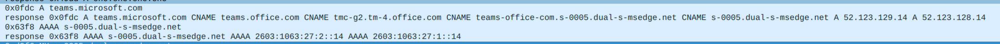

I was testing my [IPv6 DNS Proxy Server](https://gitlab.com/miyurusankalpa/IPv6-dns-server) while adding azurewebsite IPv6 support. Microsoft, unlike most providers, loves using multiple chained CNAME records. Since I needed to detect modify requests by the CNAME level, I stumbled onto a weird quirk with Linux’s `host` command.

Modern browsers send **separate A and AAAA queries** for the same domain name.
But the Linux `host` command? It does something unexpected.

It queries the **A record** using the **original name**,
then queries the **AAAA record** using the **last CNAME** in the chain.

Here’s what it looks like:

```
A lookup:
website.example.com → cname1.example.net → cname2.example.net  → (IPv4 address)

AAAA lookup:
cname2.example.net → (IPv6 address)

```

Here is how it looks like with wireshark, when resolving `teams.microsoft.com` with host command



It sends a query for `s-0005.dual-s-msedge.net` (the last CNAME of A) for AAAA records, instead of `teams.microsoft.com`.

This doesn’t usually break anything, most DNS servers return consistent chains for both A and AAAA records.
But when you’re debugging or modifying DNS requests (like I was), this behavior can cause confusion.

So next time you’re debugging DNS, **don’t just trust `host`**.
Use `dig` and inspect **both A and AAAA paths** manually to see the full picture.

