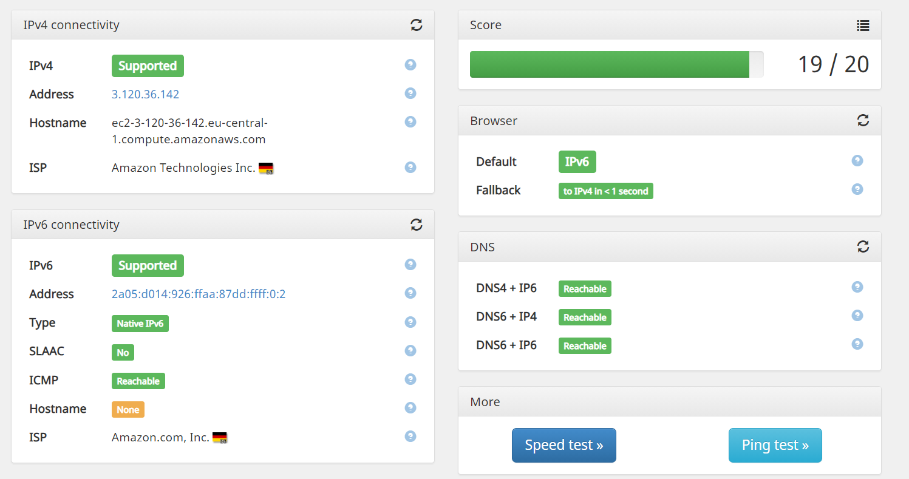

WireGuard is becoming popular with the linux people as a VPN as its integrated with the linux kernel provides better performance.

However lot of tutorials and scripts that setup wireguard do so with NATing the IPv6 address and giving the user a link local IPv6 address. This causes the operating system to prefer IPv4 over IPv6. In this tutorial we will look at setting up a simple dual stacked vpn tunnel with global IPv6 support.

I will be using a t4g.nano server in aws eu-central-1 with Debian bullseye and use add a single /80 ipv6 subnet for the instance. Some of the steps will be different for your setup.

# Network Setup

For this tutorial I will be only focusing on IPv6 network configuration.

You will need a subnet with /80 for this tutorial, However you can use smaller subnets with proper subnetting.

> ⚠️Please substitute your own subnet and network interfaces when following the tutorial.

**Original Block - 2a05:d014:926:ffaa:87dd::/80**
* For the SSH - 2a05:d014:926:ffaa:87dd::1/128
* For the VPN Endpoint - 2a05:d014:926:ffaa:87dd::123/128
* For the VPN Clients - 2a05:d014:926:ffaa:87dd:ffff::/80
* AWS network interface - ens5

We are also giving a single IPv6 for each client but you can also give a subnet per client.
For a truly proper IPv6 config you can give each client a /64 subnet and configure SLAAC.

Run the following commands to add the ips to the interface
```
sudo ip addr add 2a05:d014:926:ffaa:87dd::1/128 dev ens5
sudo ip addr add 2a05:d014:926:ffaa:87dd::123/128 dev ens5
sudo ip addr add 2a05:d014:926:ffaa:87dd:ffff::/80 dev ens5
```

> ⚠️ You can also use tools like netplan to properly setup the IPs.

Make sure to add the following to `/etc/sysctl.d/wg.conf`
```
net.ipv4.ip_forward = 1
net.ipv6.conf.all.forwarding = 1
net.ipv6.conf.ens5.accept_ra = 2
```

Run following command to apply the changes.
```
sudo sysctl --system
```

# Installing Wireguard

To install wireguard use the package manager of the system or follow the [quickstart](https://www.wireguard.com/install/
).

```
sudo apt install wireguard
```

# Server WG0 Configuration


In the IPv4 rules are we NATing the IP
```
PostUp =  iptables -t nat -A POSTROUTING -o ens5 -j MASQUERADE; 
PostDown = iptables -t nat -D POSTROUTING -o ens5 -j MASQUERADE;
```

In the IPv6 rules we are adding a rule to forward traffic to the internet interface.
```
PostUp = ip6tables -A FORWARD -i ens5 -o wg0 -j ACCEPT; ip6tables -A FORWARD -i wg0 -j ACCEPT;
PostDown = ip6tables -D FORWARD -i ens5 -o wg0 -j ACCEPT; ip6tables -D FORWARD -i wg0 -j ACCEPT;
```

For the client IP we are adding the first IPs of the designated range. In IPv6 you can allow a large subnet here and it will allow the client to move around within different IPs of the subnet.
```
AllowedIPs = 10.66.66.2, 2a05:d014:926:ffaa:87dd:ffff::2/128
```

Below is the full config. Save the file in `/etc/wireguard/wg0.conf`
```
[Interface]
Address = 10.66.66.1/24, fd42:42:42::1/64
ListenPort = 60002
PrivateKey = 
PostUp =  iptables -t nat -A POSTROUTING -o ens5 -j MASQUERADE; ip6tables -A FORWARD -i ens5 -o wg0 -j ACCEPT; ip6tables -A FORWARD -i wg0 -j ACCEPT;
PostDown = iptables -t nat -D POSTROUTING -o ens5 -j MASQUERADE; ip6tables -D FORWARD -i ens5 -o wg0 -j ACCEPT; ip6tables -D FORWARD -i wg0 -j ACCEPT;

### Client 1
[Peer]
PublicKey =
#PresharedKey =
AllowedIPs = 10.66.66.2, 2a05:d014:926:ffaa:87dd:ffff::2/128
```
To start the tunnel run the following command
```
sudo wg-quick up wg0
```

# Client Configuration

Here we are allowing a single IPv6 address. If the server config is allowing a large subnet, we can change it accordingly.
```
Address = 10.66.66.2, 2a05:d014:926:ffaa:87dd:ffff::2/128
```

Below is the full config. Save the file in `/etc/wireguard/client1.conf`
```
[Interface]
PrivateKey =
Address = 10.66.66.2, 2a05:d014:926:ffaa:87dd:ffff::2/128
DNS =  2606:4700:4700::1001

[Peer]
PublicKey =
#PresharedKey =
AllowedIPs = 0.0.0.0/0, ::/0
Endpoint = [2a05:d014:926:ffaa:87dd::123]:60002
```

To start the tunnel run the following command in linux.
```
sudo wg-quick up wg0
```

# Testing

After setting up the VPN you can test the connetion by going to test-ipv6.com

You can see that the IPv6 address is preferred over the IPv4 address.


